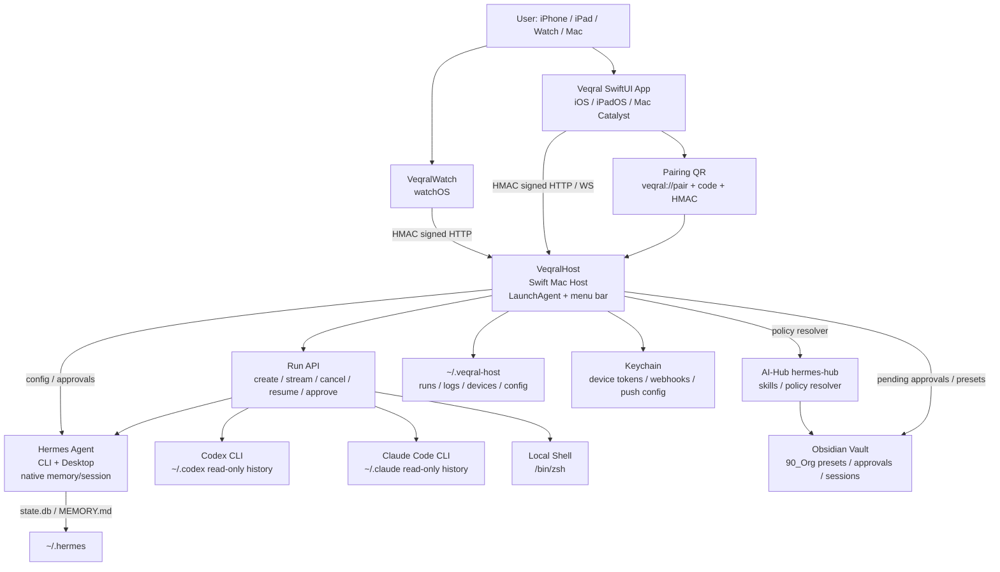
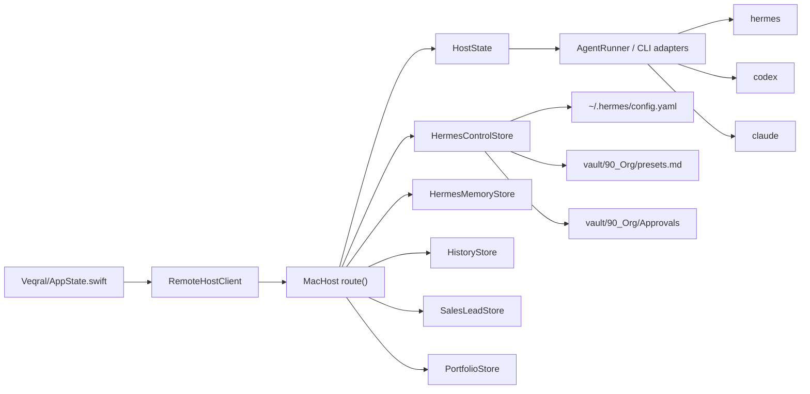
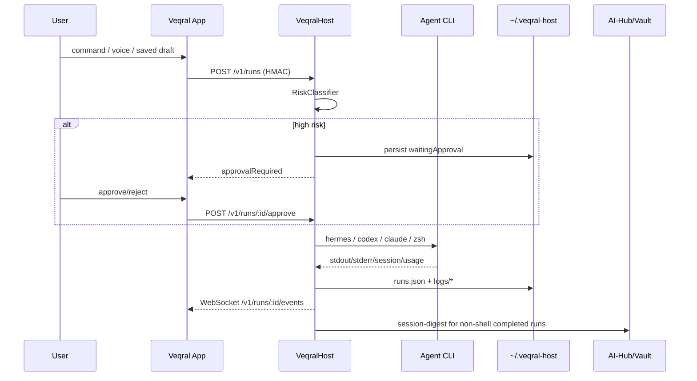

# Architecture

確認時点: 2026-06-23 15:44:42 JST

## 全体像

## コンポーネント依存

## データの流れ

## 起動時の流れ

1. LaunchAgent starts `/Users/hiroyuki/.veqral-host/bin/VeqralHost`.
2. `VeqralHostApp.main()` handles smoke subcommands first. If no smoke subcommand, it normalizes cwd to `/`.
3. `applicationDidFinishLaunching` loads `HostConfig`, creates `HostState`, starts `HostServer`, and shows menu bar status.
4. `HostConfig.load()` reads `~/.veqral-host/config.json` or creates defaults, then applies environment overrides.
5. `HostState` loads `runs.json`, `logs/`, and `devices.json`.
6. HTTP server exposes `/v1/health` without device auth and most other endpoints under HMAC auth.

根拠:
- `MacHost/Sources/VeqralHost/main.swift`
- command: `launchctl print gui/$(id -u)/dev.hiroyuki.veqral.host`

## API caller / callee

| Caller | Callee | Transport | Auth | 主な用途 |
|---|---|---|---|---|
| Veqral App | Mac Host | HTTP + WebSocket | HMAC device token | runs, devices, telemetry, memory, history, sales, portfolio |
| VeqralWatch | Mac Host | HTTP | HMAC device token | approvals, Hermes presets |
| Mac Host | Hermes CLI/config | process + file | local user permissions | Hermes runs, control, memory visibility |
| Mac Host | Codex CLI | process + read-only history | local CLI auth | direct Codex runs/history |
| Mac Host | Claude CLI | process + read-only history | local CLI auth | direct Claude runs/history |
| Mac Host | AI-Hub | script/file | local files | session digest, policy resolver |
| Mac Host | Discord webhook | HTTPS POST | webhook URL secret | notifications |
| Mac Host | APNs | HTTPS/JWT | `.p8`/team/key config | future push |

## 主要な設計判断

| 判断 | 理由 | 根拠 |
|---|---|---|
| Hermes native memory/session を正本にする | 多モデル切替時も記憶を Hermes が保持するため | `AGENTS.md`, `HERMES_MEMORY_INHERITANCE_PR0.md` |
| Direct Codex/Claude は siloed にする | それぞれの CLI native history を壊さないため | `AGENTS.md`, `HistoryStore` |
| 自作共有 memory/MCP を作らない | Hermes の記憶オーケストレーションが差別化の中核 | `AGENTS.md` |
| Pairing は QR + code + HMAC | mobile device を per-device token で保護するため | `HostState.pair`, `HMACSigner` |
| 高リスク操作は approval gate | delete/main merge/deploy/secrets 等の誤操作防止 | `RiskClassifier`, `APPROVAL_CONTEXT_PR7.md` |
| AI-Hub policy/lane resolver | モデル名固定を避け、local/subscription lane で運用するため | `AGENTS.md`, `HermesControl.swift` |
| Sales Lab は自動送信しない | outreach compliance と人間確認のため | `SALES_LAB_PR.md`, Sales smokes |

## 採用しなかった/後回しの案

| 案 | 状態 | 理由 |
|---|---|---|
| 自作共有 memory store | 不採用 | Hermes native memory を正本にする方針と衝突。 |
| MCP を記憶バックボーンにする | 不採用 | `AGENTS.md` の禁止事項。 |
| Mac mini 2 台目 Host | 後回し | 既存 Host インフラを再利用し、段階的に進める方針。 |
| App Store / Gateway / Cron を Veqral 側に足す | 後回し/範囲外 | 今回の Veqral scope では作らない方針。 |
| Google Places 非公式 scraping | 不採用 | 利用規約/法務/データ保持リスク。公式 API は別 PR。 |
| APNs push を free team で通す | 未運用 | capability/credential 制約。 |
