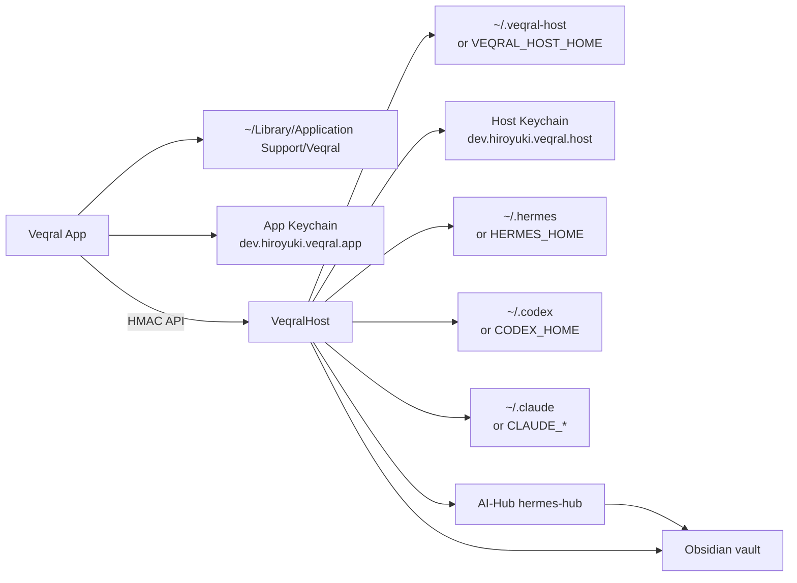

# Data and state

確認時点: 2026-06-23 15:44:42 JST

## データフロー図

## 保存先一覧

| データ | 保存場所 | 正本 | 作成/更新者 | 消してよいか | 根拠 |
|---|---|---|---|---|---|
| App snapshot | `~/Library/Application Support/Veqral/command-center-state.json` | App local state | Veqral app | 消すと app 状態 reset。通常は消さない。 | `Veqral/AppState.swift` |
| Saved command drafts | `~/Library/Application Support/Veqral/saved-command-drafts.json` | local fallback | Veqral app | 消すと local drafts 消失。 | `Veqral/AppState.swift` |
| Saved command iCloud cache | iCloud ubiquity `Documents/Veqral/saved-command-drafts.json` | best-effort sync | Veqral app | 消すと sync cache 消失。 | `Veqral/AppState.swift` |
| Remote Host token on app | Keychain service `dev.hiroyuki.veqral.app`, account `remote-host:<deviceID>` | App auth material | Veqral app | 消すと再 pairing 必要。値は記録禁止。 | `Veqral/AppState.swift` |
| Host config | `~/.veqral-host/config.json` or `VEQRAL_HOST_HOME/config.json` | Host runtime config | Host | backup 後のみ。 | `HostConfig` |
| Paired devices | `~/.veqral-host/devices.json` | Host device registry | Host | 消すと全 device 再 pairing。 | `HostState.devicesURL` |
| Host device tokens | Keychain service `dev.hiroyuki.veqral.host`, account `device:<deviceID>` | Host auth material | Host | 消すと device auth 失敗。値は記録禁止。 | `HostState.pair`, `KeychainStore` |
| Runs | `~/.veqral-host/runs.json` | Host run list | Host | 消すと Host run history 消失。 | `HostState.runsURL` |
| Run logs | `~/.veqral-host/logs/` | Host log replay | Host | 消すと log replay 消失。 | `HostState.logsFolder` |
| Audit log | `~/.veqral-host/audit.log` | Host audit | Host | 消す前に保全。 | `HostState.auditURL` |
| Attachments | `~/.veqral-host/attachments/<runID>/` | uploaded run artifacts | Host | run artifact として必要なら保持。 | `AttachmentStore` |
| Portfolio registry | `~/.veqral-host/portfolio-registry` default or configured repo/path | Portfolio asset metadata | Host/git | registryなら backup/commit 必須。 | `HostConfig.resolvedPortfolioRegistryPath` |
| Sales leads | `~/.veqral-host/local-business-leads/leads.json` | Sales Lab lead data | Host | 個人/営業データを含む可能性。消さない。 | `SalesLeadStore` |
| Sales artifacts | `~/.veqral-host/local-business-leads/{screenshots,audits,mocks,proposals}` | generated artifacts | Host | lead と関連。消すなら lead との整合に注意。 | `SalesLeadStore` |
| Hermes config | `~/.hermes/config.yaml` or `VEQRAL_HERMES_CONFIG` | Hermes runtime config | Hermes / Veqral control | 直接編集は慎重に。backupあり。 | `HermesControl.swift` |
| Hermes config backup | `~/.hermes/config.yaml.veqral-bak` | pre-update backup | Veqral Host | rollback に必要。 | `HermesControl.swift` |
| Hermes auth | `~/.hermes/auth.json` | auth material | Hermes | 値の閲覧/記録禁止。 | `VeqralHostSmoke`, AGENTS |
| Hermes memory | `~/.hermes/memories/USER.md`, `MEMORY.md` | Hermes native memory | Hermes / approved edits | Project memory は read-only 表示。汎用編集は diff 後。 | `HermesMemoryStore` |
| Hermes sessions | `~/.hermes/state.db` | Hermes native session DB | Hermes | 正本。削除禁止。 | `HermesMemoryStore`, `HermesUsageStore` |
| Hermes skills | `~/.hermes/skills/**/*.md` | Hermes skill docs | Hermes/user | Host memory API で編集可だが慎重に。 | `HermesMemoryStore` |
| Codex history | `~/.codex/sessions`, `~/.codex/archived_sessions` | Codex native history | Codex | read-only。 | `HistoryStore`, AGENTS |
| Claude history | `~/.claude/projects` | Claude native history | Claude Code | read-only。 | `HistoryStore`, AGENTS |
| AI-Hub root | `VEQRAL_AIHUB_ROOT` or default `~/Documents/AI-Hub/hermes-hub` | AI-Hub scripts/config | AI-Hub | repo管理に従う。 | `HostConfig`, `AIHubSessionDigestBridge` |
| AI-Hub config | `VEQRAL_AIHUB_CONFIG`, `AI_HUB_CONFIG`, or `<root>/config/vault.yaml` | session-digest config | AI-Hub | 値/paths を確認。 | `HostConfig`, `AIHubSessionDigestBridge` |
| Obsidian vault approvals | `<vault>/90_Org/Approvals/{pending,approved,rejected}` | vault approval queue | AI-Hub/Hermes/Veqral | pending を勝手に移動しない。 | `HermesControl.swift` |
| Obsidian presets | `<vault>/90_Org/presets.md` | Hermes preset/policy table | user/AI-Hub | placeholders は UI で無効扱い。 | `HermesControl.swift` |
| Session digest notes | `<vault>/90_Org/Sessions/YYYY-MM-DD-session-digest.md` | curated session digest | AI-Hub digest bridge | raw history正本ではない。 | `AIHubSessionDigestBridge` |

## State の正本

| 領域 | 正本 |
|---|---|
| Hermes chat/history/memory | `~/.hermes/state.db` と `~/.hermes/memories/MEMORY.md` |
| Codex direct history | `~/.codex` |
| Claude direct history | `~/.claude` |
| Veqral remote run state | `~/.veqral-host/runs.json` と `logs/` |
| Paired mobile auth | Host/App Keychain |
| AI-Hub curated notes | Obsidian vault under AI-Hub |
| Handoff docs | `docs/handover/` and `AGENTS.md` |

## Migrations

リポジトリ内に database migration framework は確認していない。SQLite を直接読む箇所は Hermes `state.db` read-only query。Host 自身の state は JSON files で schema evolution を Swift `Codable` optional/defaults に寄せている。

根拠:
- command: `rg -n "state.db|\\.json|migrations|sqlite" MacHost/Sources Veqral`
- `HermesMemoryStore`, `HermesUsageStore`, `CommandCenterSnapshot`

## Backup / restore

| 対象 | backup 方法 | restore 方法 | 注意 |
|---|---|---|---|
| `~/.veqral-host` | folder copy | Host stop -> folder restore -> Host start | device tokens are in Keychain, folderだけでは完全復元しない。 |
| App state | copy Application Support/Veqral | app stop -> restore | Keychain token は別。 |
| Hermes config | `.veqral-bak` or copy config | copy back to `~/.hermes/config.yaml` | running session への即時反映は Hermes 側仕様に依存。 |
| Hermes DB/memory | copy `~/.hermes` | restore whole Hermes home | auth/secretsを含むため扱い注意。 |
| AI-Hub vault | git/sync/backups | normal vault restore | heavy raw archive は local-only 方針。 |

## データ破壊リスク

- `~/.codex`, `~/.claude`, `~/.hermes/state.db` を編集/削除すると native history が壊れる。
- `~/.veqral-host/devices.json` と Host Keychain がずれると pairing/auth が壊れる。
- `HermesControl.swift` は `config.yaml` を行単位で書く。backup はあるが、人間が同時編集していると競合リスクがある。
- Sales Lab generated artifacts と `leads.json` は相互参照。片方だけ消すと UI の保存先リンクが切れる。
- Obsidian `Approvals/pending` を手で動かすと Veqral/Watch の pending 表示と食い違う。

根拠:
- `AGENTS.md`
- `MacHost/Sources/VeqralHost/main.swift`
- `MacHost/Sources/VeqralHost/HermesControl.swift`
