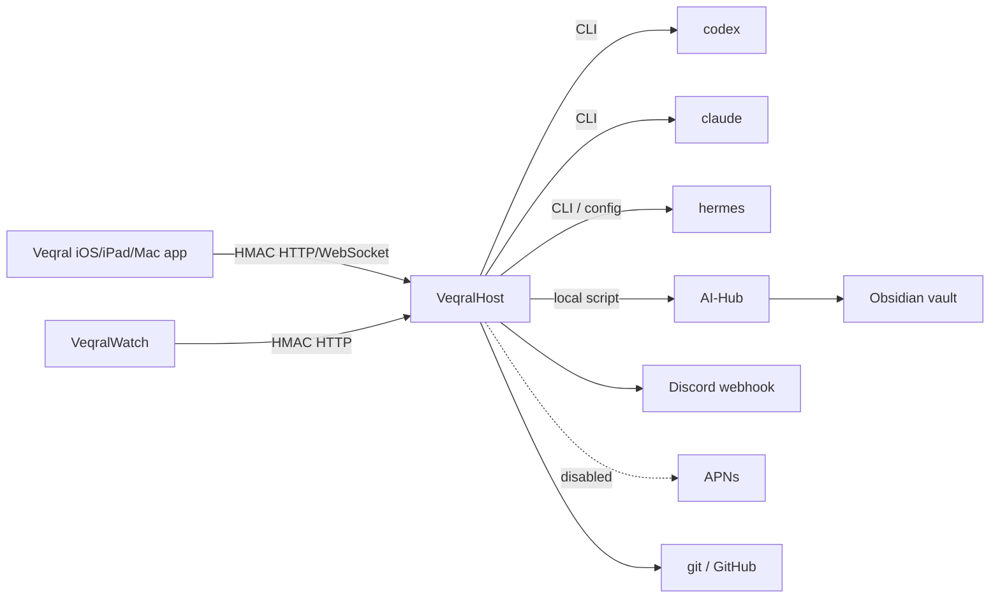

# Integrations and external services

確認時点: 2026-06-23 15:44:42 JST

## Integration map

| 連携先 | 用途 | 使用箇所 | 設定場所 | 認証方式 | 失敗時の影響 | 確認方法 |
|---|---|---|---|---|---|---|
| Hermes Agent | Project memory, model/provider orchestration, session history | Host runtime, Memory, Hermes control | `~/.hermes`, `VEQRAL_HERMES_CONFIG`, `VEQRAL_HERMES_VAULT` | Hermes native auth/session | Hermes mode, memory visibility, preset control fail | `/v1/health`, `smoke-hermes-control`, `smoke-project-memory` |
| Codex CLI | direct Codex remote runs/resume/history | Host run executor, HistoryStore | `codex` in PATH, `CODEX_HOME` optional | Codex CLI auth | direct Codex runs/resume fail | `/v1/health`, direct run smoke/manual |
| Claude Code CLI | direct Claude remote runs/resume/history | Host run executor, HistoryStore | `claude` in PATH, `CLAUDE_CONFIG_DIR`/`CLAUDE_HOME` optional | Claude Code auth | direct Claude runs/resume fail | `/v1/health`, direct run manual |
| AI-Hub | Hermes policy resolver, session digest, vault conventions | `HermesControl.swift`, digest bridge | `VEQRAL_AIHUB_ROOT`, `VEQRAL_AIHUB_CONFIG`, `AI_HUB_CONFIG` | local files/scripts | policy apply and session digest fail | `smoke-aihub-digest-bridge`, `smoke-hermes-control` |
| Obsidian vault | approvals, presets, session notes | Hermes control and AI-Hub digest | `VEQRAL_HERMES_VAULT` | local file access | presets/approvals/session notes unavailable | `/v1/hermes/control`, `/v1/hermes/approvals` |
| Ollama | local model backend for AI-Hub policy lanes | AI-Hub resolver and Hermes config | local Ollama service / models | local OpenAI-compatible endpoint | local policies fail or fall back | `ollama list`, AI-Hub resolver, health |
| OpenAI-compatible custom endpoint | local or remote provider via Hermes | Hermes config/policy | Hermes config, AI-Hub policy | endpoint/API key if remote | model calls fail | Hermes run / resolver |
| OpenAI Codex subscription route | Hermes same-provider memory smoke and runtime | Hermes memory verifier | `~/.hermes/auth.json` via Hermes | Hermes login auth, not repo secret | Gate1 memory smoke fails | `VeqralHostSmoke verify-memory-inheritance` |
| Anthropic/Claude route via Hermes | intended cross-vendor proof | memory verifier | Hermes Claude/Anthropic login | subscription/login only for proof | cross-vendor #A7 remains blocked | `HERMES_CROSS_VENDOR_PR_A7.md` commands |
| Discord webhook | approval/run/down notifications | Host notification service, Portfolio | env/Keychain/config | webhook URL secret | notifications absent | `smoke-discord-notifications`, real webhook test |
| APNs | push notifications | Host `APNsPushSender`, app entitlements/categories | `VEQRAL_APNS_*`, app capability | Apple `.p8` key/team/key id | push unavailable | paid Apple setup then push test |
| GitHub | repo metadata, Portfolio discover/commits | Host Portfolio, development workflow | GitHub CLI/auth, local git remotes | GitHub OAuth/token outside repo | PR/issues/Portfolio GitHub features fail | `gh repo view`, Portfolio API |
| Tailscale | device-to-Mac network reachability | pairing endpoint and app Host connection | Tailscale client/account | Tailscale identity outside repo | devices cannot reach Host remotely | app connection, ping/health from device |
| Apple Keychain | app/host device tokens, webhook/API config accounts | App and Host KeychainStore | Keychain services | local Keychain | pairing/auth/webhook credentials unavailable | re-pair, security CLI if approved |
| iCloud Documents | saved command draft sync | app saved command store | user iCloud Documents | Apple account | drafts fall back to local only | real device cross-device test |
| Speech / AVFoundation | voice dictation | app command composer | iOS permissions | OS privacy permission | voice input unavailable | manual device voice test |
| Local Network / Camera | QR pairing and Host access | app pairing UI | Info.plist usage permissions | OS privacy permission | QR/local pairing fails | manual pairing test |
| Google Places | future Sales Lab discovery | intentionally disabled endpoint | not configured | would require API key | discovery returns disabled/unavailable | route returns disabled; future PR |

## API caller / callee

## Failure isolation

| If this fails | Still expected to work |
|---|---|
| Hermes | direct Codex/Claude modes may still work |
| Codex CLI | Hermes and Claude direct may still work |
| Claude CLI | Hermes and Codex direct may still work |
| AI-Hub resolver | direct run modes and fixed Hermes config may still work; policy preset apply may fail |
| Discord | Run execution should continue; notifications absent |
| APNs | in-app polling/WebSocket still works because push is not core runtime |
| Tailscale | local Mac access may work; remote device access fails |
| iCloud Documents | saved commands fall back to local storage |

## Integrations intentionally not active

| Integration | Status | Reason / guardrail |
|---|---|---|
| APNs push | feature path exists but not operational | free personal team and explicit future setup requirement |
| Google Places discovery | endpoint disabled/501 | ToS/quota/API key policy not designed |
| Automated Sales Lab outbound sending | not implemented by policy | outbound sending must stay approval-gated |
| Custom shared memory/MCP | prohibited | Hermes native memory/session is the backbone |
| App Store/TestFlight deploy | not configured in repo | outside current local-first scope |

根拠:
- `AGENTS.md`
- `MacHost/Sources/VeqralHost/main.swift`
- `MacHost/Sources/VeqralHost/HermesControl.swift`
- `Veqral/AppState.swift`
- `Veqral/Info.plist`
- `SALES_LAB_PR.md`
- command: `curl -fsS http://127.0.0.1:7878/v1/health`
